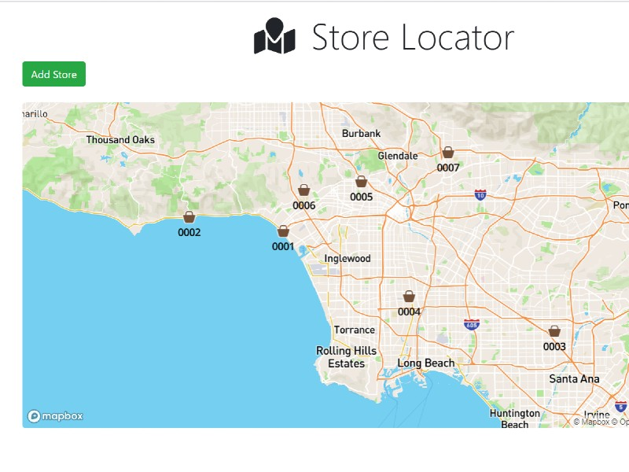

# Store Locator

A simple store locator web app.



## Setup

Clone the respository, and create config.env in /config. Replace MONGO_URI and GEOCODER_API_KEY with your values.

```
NODE_ENV=development
PORT=5000
MONGO_URI=XXXXXXXXX
GEOCODER_PROVIDER=mapquest
GEOCODER_API_KEY=XXXXXX
```

## Tech

- [node.js](http://nodejs.org) - evented I/O for the backend
- [Express](http://expressjs.com) - fast node.js network app framework
- [MongoDB](https://www.mongodb.com/) - general purpose, document-based, distributed database
- [Mongoose](https://mongoosejs.com/) - elegant mongodb object modeling for node.js
- [node-geocoder](https://github.com/nchaulet/node-geocoder) - Node library for geocoding and reverse geocoding.

## Demo

https://store-locator2849.herokuapp.com/

## License

MIT
